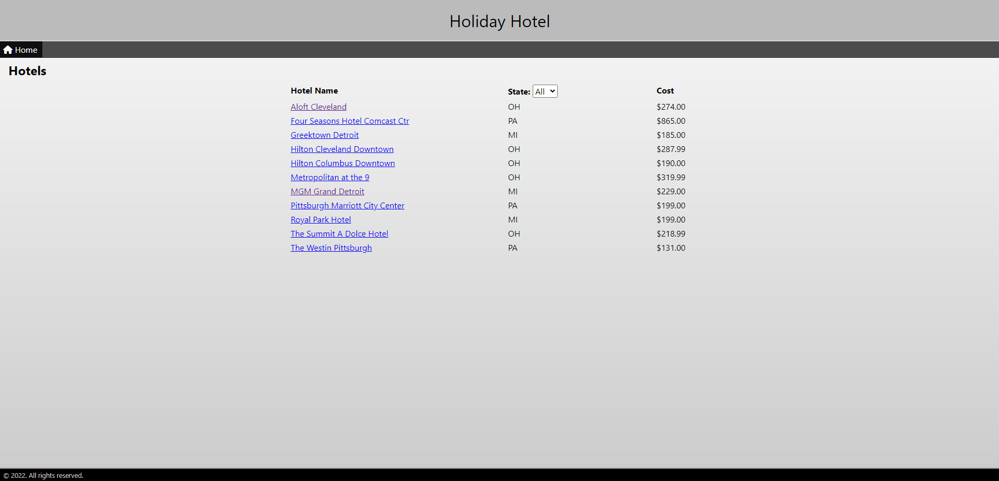

# Holiday Hotel

## Table of Contents
1. [About The Project](#about-the-project)
2. [Features](#features)
3. [Getting Started](#getting-started)



## About The Project

This complete, end-to-end, full-stack web application allows a user to shop for hotels. After selecting a hotel, the user can create, read, update, and delete hotel reservations.

### Features

* The `client` folder contains the Vue frontend application. It includes Vue Router and Vuex.
* The `database` folder contains a script to create and populate a PostgreSQL database.
* The `postman` folder contains a Postman collection of requests that exercise all the API endpoints.
* The `server` folder contains a Java Spring MVC project that implements a Hotel API.

### Hotel API

These are the endpoints in the Hotel API. For details on the properties of each type of data, see the sample data in the sections that follow.

| Endpoint | Description | Request | Response |
| --- | --- | --- | --- |
| `GET /hotels` | List all hotels. | - | `List<Hotel>` | 
| `GET /hotels?state=OH&city=Cleveland` | List hotels filtered by state and city. Both parameters are optional. | - | `List<Hotel>` | 
| `GET /hotels/states` | List all states in which there are hotels. States returned as two-letter abbreviations. | - | `List<String>` |
| `GET /hotels/{id}` | Get the hotel with `hotelId` == `id`. | - | `Hotel` |
| `GET /hotels/{id}/reservations` | List all reservations for the hotel with `hotelId` == `id`. | - | `List<Reservation>` |
| `GET /reservations` | List all reservations in the system. | - | `List<Reservation>` |
| `GET /reservations/{id}` | Get the reservation with `reservationId` == `id`. | - | `Reservation` |
| `POST /reservations` | Add a new reservation. | `Reservation` | `Reservation` |
| `PUT /reservations/{id}` | Update the reservation with `reservationId` == `id`. | `Reservation` | `Reservation` |
| `DELETE /reservations/{id}` | Delete the reservation with `reservationId` == `id`. | - | - |

### Hotel sample data

```json
{
    "id": 1,
    "name": "Aloft Cleveland",
    "address": {
        "id": "d3494dd3-e8f2-442f-abf2-3670d81ee051",
        "address": "1111 W 10th St",
        "address2": null,
        "city": "Cleveland",
        "state": "OH",
        "zip": "44115"
    },
    "stars": 4,
    "roomsAvailable": 48,
    "costPerNight": 274.0,
    "coverImage": "aloft.png"
}
```

### Reservation sample data

```json
{
    "id": 4,
    "hotelId": 1,
    "fullName": "Leopoldine Drovin",
    "checkinDate": "2022-09-29",
    "checkoutDate": "2022-10-04",
    "guests": 4
}
```

### State sample data

```json
[
    "MI",
    "OH",
    "PA"
]
```

## Getting started

### Database

1) Open PGAdmin.
2) Create a new database called `hotelDB`.
3) Open the script file `database/hotelDB.sql` in a query window, and execute the script.

### Server

1) Open the project in the `server` folder in IntelliJ.
2) Start the server by running `src/main/java/com/techelevator/reservations/HotelReservationsApplication.main()`.

### Postman

1) Import the collection into Postman. 
2) With the server running, you can execute any of the requests in the collection. 

This is a great way to understand the API, and it shows you exactly what data to send to and expect from each API endpoint.

### Client

1) Open the project in the `client` folder in Visual Studio Code.
2) In a terminal window, resolve dependencies by running `npm install`.
3) Start the application by running `npm run serve`.
4) Ctrl-Click the local URL to launch the application in the browser.
